  
  
  
  

I'm a full-stack engineer who turns complex data into clean, trustworthy products. I made **[CareerVivid](https://careervivid.app)**, an AI platform for resumes, portfolios, and interview prep, and I like building small, odd things on the side.

## 🧱 What I'm building right now

<!-- now-building:start -->

<b>What else I've touched lately</b>

- **[3D-Craft](https://github.com/JiawenZhu/3D-Craft)** – Local-first Rodin-style 3D generation workspace — Hunyuan3D-2.1, TRELLIS.2 and Rodin via… (Oct 1, 2026)
- **[restage](https://github.com/JiawenZhu/restage)** – An agent that edits images toward a stated outcome — UGC first, room staging second. Desi… (Aug 30, 2026)
- **[careervivid-ios](https://github.com/JiawenZhu/careervivid-ios)** – iOS app for Vivid (mock interviews, skill tree, and real company questions). (Jul 21, 2026)
- **[apex-fan-mongodb](https://github.com/JiawenZhu/apex-fan-mongodb)** – World Cup 2026 fan concierge for the Google Cloud Rapid Agent Hackathon MongoDB track (Jun 1, 2026)
- **[ledgerflow-fivetran](https://github.com/JiawenZhu/ledgerflow-fivetran)** – Fivetran revenue pipeline risk agent for the Google Cloud Rapid Agent Hackathon (May 25, 2026)

<!-- now-building:end -->

🤖 This section updates itself. Every few hours a GitHub Action checks which public repo I pushed to last and redraws the card.

## 🏙️ My commit city

## 🚀 Things I've shipped

<table>
  <tr>
    <td colspan="2" valign="top">
      
      <h3><a href="https://3d-craft.web.app">3D Craft</a> 🆕</h3>
      Turn an idea or a reference image into concept art, then a 3D model you can light, animate, and drop into a game. On iPhone, iPad, and the web.
        
      
      
      
        <code>SwiftUI</code> <code>React</code> <code>Firebase</code> <code>fal.ai</code> <code>3D generation</code>
    </td>
  </tr>
  <tr>
    <td width="50%" valign="top">
      
      <h3><a href="https://careervivid.app/learning/">CCAF Quest</a></h3>
      A walkable 3D city that turns Claude Certified Architect exam prep into 45 missions. Walk into a building, take the briefing, earn XP.
        <code>Three.js</code> <code>React</code> <code>Game design</code>
    </td>
    <td width="50%" valign="top">
      
      <h3><a href="https://careervivid.app">CareerVivid</a></h3>
      Rehearses the whole job hunt: staged mock interview loops for 301 companies, 203 hands-on lessons, and AI resume tailoring.
        <code>React</code> <code>Firebase</code> <code>Vertex AI</code>
    </td>
  </tr>
  <tr>
    <td width="50%" valign="top">
      
      <h3><a href="https://github.com/JiawenZhu/teamusa-gemini-analyst">TeamUSA Gemini Analyst</a></h3>
      Matches you to an athlete archetype from 120 years of Team USA Olympic history, with Gemini as your coach.
        <code>Gemini</code> <code>Google Cloud</code> <code>D3</code>
    </td>
    <td width="50%" valign="top">
      
      <h3><a href="https://github.com/JiawenZhu/megamillions-engine">MegaMillions Engine</a></h3>
      A probability engine with hot/cold frequency, positional vectors, and a Thompson-sampling bandit on top.
        <code>Python</code> <code>Statistics</code> <code>Bandits</code>
    </td>
  </tr>
</table>

## 🧰 Toolbox

## 🎲 Fun facts

- 🎰 I taught a multi-armed bandit to play the lottery. The lottery is still winning.
- 🏛️ I studied for a certification by building a city and walking around it.
- 🧱 Every block in my commit city is a real day of commits. The tall red ones were good days.
